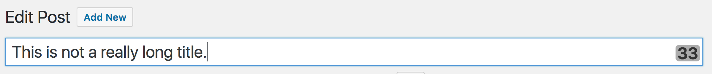
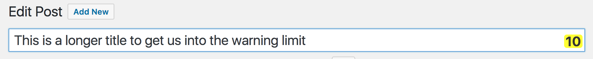
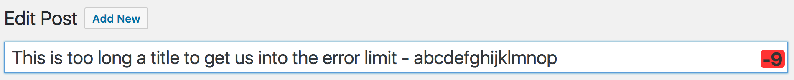

field-length-alert
=====================

Field Length Alert System

This plugin watches the length of specified fields in the editor and warns the
user via the field length message at the end of the field when the text exceeds
some predefined length. We have two thresholds: `warn_threshold` and `error_threshold`,
each of which can be configured to change the length count to a different color
to warn the writer.

Usage
=============
The warn and error threshold settings are set when calling the
filter like this:
```
window.TenUp.fieldLengthAlert( {
	target: '#mayo_link_url', // ID of field container
	error_threshold: 22, // The character count to change to a error
	warn_threshold: 18, // The character count to change to a warning
	direction: 'down' // allows for count down or count up configuration, default is count down.
}, function() {
	console.log( 'Amazing callback function!' ); // callback function if needed.
} );
```

Options
=============

_ Note: the default counts are arbitrary and easily overridden in the call. _

| Option | Type | Default | Description|
| ------ | ---- | ----------- |
| target | string | _null_ | The css target used to find the fields. Can accept classes, IDs, etc. Uses `document.querySelectorAll()` and iterates through all instances. |
| warn_threshold | int | 65 | The character count at which the `-warn` class should be added to the counter - gives the editor warning that they are approaching the limit. |
| error_threshold | int | 55 | The character count at which the `-error` class should be added to the counter - this is the "hard" limit. Note this plugin does not prevent a longer entry - just lets the editor know they've exceeded the limit and _stuff may break_&trade; |
| direction | string | "down" | Whether the counter should count "up" (from zero) or "down" (from limit - default). |

Styles are overridable in the theme and have been kept as simple as possible to allow for such.

Examples (using title field)
=============
Typical count:


Warning count:


Error count:


Note that the default option (`direction: 'down'`) will show a negative number when you go over the limit - handy for showing how many characters you need to remove! If you really want an incremental count you can set this to `'up'`.

Props
=============
To [@borkweb](https://github.com/borkweb) for the [original inspiration](https://github.com/borkweb/go-title-length-alert), and the [10up Component Library](https://github.com/10up/wp-component-library) that I modeled some of the initial code structure off.

To [@timwright12](https://github.com/timwright12) for code review and suggestions.

To [@bengrace](https://github.com/bengrace) and [@McCallumDillon](https://github.com/McCallumDillon) for design insight.
